# Eden - Homelab Infrastructure

My personal lab environment for experimenting with infrastructure and hosting self-hosted services. Professionally, I work with these technologies daily, but the homelab gives me freedom to explore ideas and patterns that don't always fit production constraints. This is where curiosity meets practicality, testing new tools, solving real problems at home, and yes, occasionally breaking things in the pursuit of learning.

The repository is public by design. Transparency keeps me honest about following best practices, even when it's just for fun.

Want to learn more about me or what I work with? Visit [nordbye.it](https://nordbye.it)

Feel free to send me a DM, open a pull request, or steal code from here—the goal is to learn and make connections.

## Network Overview

```mermaid
graph TD
    %% Monochrome Professional Styling
    classDef default fill:#2c3e50,stroke:#34495e,stroke-width:2px,color:#fff;
    classDef internet fill:#34495e,stroke:#2c3e50,stroke-width:3px,color:#fff;
    classDef subgraphStyle fill:#ecf0f1,stroke:#95a5a6,stroke-width:2px,color:#2c3e50;

    %% Network Core
    WEB(("☁️<br/>Internet")):::internet
    MDM["📶 Telia Modem<br/><i>Coax</i>"]
    UCG["🌐 UniFi Gateway<br/><i>Router</i>"]
    SW["🔗 UniFi Switch<br/><i>8-Port PoE</i>"]

    WEB --> MDM
    MDM --> UCG
    UCG --> SW

    %% Storage
    subgraph NAS["💿 Synology DS1522+"]
        direction TB
        PBS["💾 Proxmox Backup Server"]
    end
    SW --> NAS

    %% Home Automation
    subgraph HA_Box["🏡 Home Assistant"]
        direction TB
        AGH["🚫 AdGuard Home"]
    end
    SW --> HA_Box

    %% Proxmox Cluster
    subgraph HyperCluster["🖥️ Hyper-cluster - Proxmox VE"]
        direction TB

        subgraph H1["⚙️ Hyper1 - Proxmox Node"]
            direction TB
            C1["🎛️ genesis-ctrl-01"]
            C2["🎛️ genesis-ctrl-02"]
            W1["⚡ genesis-worker-01"]
        end

        subgraph H2["⚙️ Hyper2 - Proxmox Node"]
            direction TB
            C3["🎛️ genesis-ctrl-03"]
            W2["⚡ genesis-worker-02"]
            W3["⚡ genesis-worker-03"]
        end

        K8S["☸️ Genesis - Talos Kubernetes Cluster"]
        C1 -.-> K8S
        C2 -.-> K8S
        C3 -.-> K8S
        W1 -.-> K8S
        W2 -.-> K8S
        W3 -.-> K8S
    end
    SW --> HyperCluster

    %% Access Point
    AP["📡 UniFi U6+<br/><i>WiFi 6 AP</i>"]
    SW --> AP

    %% IoT & Smart Home Devices
    HUE["💡 Hue Bridge Pro"]
    ZBT["📶 Nabu Casa ZBT-2<br/><i>Zigbee</i>"]
    BLE["🔵 M5Stack Atom Lite<br/><i>Bluetooth</i>"]
    CAM["📹 UniFi G6 Instant"]

    SW --> HUE <--> HA_Box
    AP --> BLE <--> HA_Box
    AP --> CAM <--> HA_Box
    HA_Box --> ZBT
```

## Kubernetes Application Stack

```mermaid
graph TB
    %% Monochrome Professional Styling
    classDef default fill:#2c3e50,stroke:#34495e,stroke-width:2px,color:#fff;

    %% GitOps Layer
    REPO["📦 GitHub Repository"]
    ARGO["🔄 ArgoCD"]

    REPO --> ARGO

    %% Infrastructure Layer
    subgraph INFRA["🔧 Infrastructure"]
        direction TB
        ARGOCD["🔄 argocd"]
        CILIUM["🕸️ cilium"]
        TRAEFIK["🚪 traefik"]
        CERT["🔒 cert-manager"]
        PROM["📊 kube-prometheus-stack"]
        METRICS["📈 metrics-server"]
        OTEL["📡 otel-collector"]
        CSI["💾 proxmox-csi-plugin"]
        NFS["📁 syno-nfs-prov"]
        ESO["🔐 external-secrets-operator"]
        CRDS["📦 crds"]
    end

    %% Application Layer
    subgraph APPS["📱 Applications"]
        direction TB
        PLEX["🎬 plex-media-stack"]
        ARR["📚 arr-stack"]
        AUDIO["🎧 audiobookshelf"]
        PORTFOLIO["💼 portfolio"]
        PORTFOLIOS["💼 portfolio-stage"]
        HOME["🏠 homepage"]
        TOOLS["🔧 it-tools"]
        OMNI["🔧 omni-tools"]
        VPN["🔒 gluetun-vpn"]
    end

    ARGO --> INFRA
    ARGO --> APPS
```

## Hardware

### Compute Nodes

| Node   | Model                        | CPU                                     | RAM   | Storage |
| ------ | ---------------------------- | --------------------------------------- | ----- | ------- |
| Hyper1 | Lenovo ThinkCentre M920 Tiny | Intel Core i7-8700T (6C/12T @ 2.40 GHz) | 32 GB | 1 TB    |
| Hyper2 | Lenovo ThinkCentre M920q     | Intel Core i5-8500T (6C/6T @ 2.10 GHz)  | 32 GB | 1 TB    |

### Storage

| Device | Model            | Capacity        | Details                        |
| ------ | ---------------- | --------------- | ------------------------------ |
| NAS    | Synology DS1522+ | 3 × 20TB (60TB) | SHR, Btrfs, 2 × 1TB NVMe cache |

### Network Equipment

| Device       | Model               | Type           |
| ------------ | ------------------- | -------------- |
| Router       | UniFi Cloud Gateway | Gateway/Router |
| Switch       | UniFi Lite 8 PoE    | Managed Switch |
| Access Point | UniFi U6+           | WiFi 6 AP      |
| Modem        | Telia               | Cable Modem    |

### IoT & Smart Home

#### Home Assistant Server

| Component | Model                       | CPU        | RAM | Network         |
| --------- | --------------------------- | ---------- | --- | --------------- |
| Hardware  | Topton N100 Fanless Mini PC | Intel N100 | TBD | 4 × 2.5G i226-V |

#### Devices

| Device                  | Type               | Purpose                    |
| ----------------------- | ------------------ | -------------------------- |
| Philips Hue Bridge Pro  | Smart Lighting Hub | Lighting control           |
| Nabu Casa Connect ZBT-2 | Zigbee Coordinator | Zigbee device coordination |
| M5Stack Atom Lite       | Bluetooth Proxy    | Bluetooth range extension  |
| UniFi G6 Instant        | Security Camera    | Indoor surveillance        |
