# Homelab Infrastructure

My home infrastructure managed as code using GitOps principles.

## Network Overview

```mermaid
graph TD
    %% Monochrome Professional Styling
    classDef default fill:#2c3e50,stroke:#34495e,stroke-width:2px,color:#fff;
    classDef internet fill:#34495e,stroke:#2c3e50,stroke-width:3px,color:#fff;
    classDef subgraphStyle fill:#ecf0f1,stroke:#95a5a6,stroke-width:2px,color:#2c3e50;

    %% Network Core
    WEB(("☁️<br/>Internet")):::internet
    MDM["📶 Telia Modem<br/><i>Coax</i>"]
    UCG["🌐 UniFi Gateway<br/><i>Router</i>"]
    SW["🔗 UniFi Switch<br/><i>8-Port PoE</i>"]

    WEB --> MDM
    MDM --> UCG
    UCG --> SW

    %% Storage
    subgraph NAS["💿 Synology DS1522+"]
        direction TB
        PBS["💾 Proxmox Backup Server"]
    end
    SW --> NAS

    %% Home Automation
    subgraph HA_Box["🏡 Home Assistant"]
        direction TB
        AGH["🚫 AdGuard Home"]
    end
    SW --> HA_Box

    %% Kubernetes Cluster
    subgraph Cluster["☸️ Genesis Cluster - Proxmox VE"]
        direction TB

        subgraph H1["⚙️ Hyper1"]
            direction TB
            C1["🎛️ genesis-ctrl-01"]
            C2["🎛️ genesis-ctrl-02"]
            W1["⚡ genesis-worker-01"]
        end

        subgraph H2["⚙️ Hyper2"]
            direction TB
            C3["🎛️ genesis-ctrl-03"]
            W2["⚡ genesis-worker-02"]
            W3["⚡ genesis-worker-03"]
        end
    end
    SW --> Cluster

    %% IoT Devices
    HUE["💡 Hue Bridge Pro"]
    SW --> HUE
```

## Hardware

### Compute Nodes

| Node   | Model                        | CPU                                     | RAM   | Storage |
| ------ | ---------------------------- | --------------------------------------- | ----- | ------- |
| Hyper1 | Lenovo ThinkCentre M920 Tiny | Intel Core i7-8700T (6C/12T @ 2.40 GHz) | 32 GB | 1 TB    |
| Hyper2 | Lenovo ThinkCentre M920q     | Intel Core i5-8500T (6C/6T @ 2.10 GHz)  | 32 GB | 1 TB    |

### Storage

| Device | Model            | Capacity        | Details                        |
| ------ | ---------------- | --------------- | ------------------------------ |
| NAS    | Synology DS1522+ | 3 × 20TB (60TB) | SHR, Btrfs, 2 × 1TB NVMe cache |

### Network Equipment

| Device       | Model               | Type           |
| ------------ | ------------------- | -------------- |
| Router       | UniFi Cloud Gateway | Gateway/Router |
| Switch       | UniFi Lite 8 PoE    | Managed Switch |
| Access Point | UniFi U6+           | WiFi 6 AP      |
| Modem        | Telia               | Cable Modem    |

### IoT & Smart Home

#### Home Assistant Server

| Component | Model                       | CPU        | RAM | Network         |
| --------- | --------------------------- | ---------- | --- | --------------- |
| Hardware  | Topton N100 Fanless Mini PC | Intel N100 | TBD | 4 × 2.5G i226-V |

#### Devices

| Device                  | Type               | Purpose                    |
| ----------------------- | ------------------ | -------------------------- |
| Philips Hue Bridge Pro  | Smart Lighting Hub | Lighting control           |
| Nabu Casa Connect ZBT-2 | Zigbee Coordinator | Zigbee device coordination |
| M5Stack Atom Lite       | Bluetooth Proxy    | Bluetooth range extension  |
| UniFi G6 Instant        | Security Camera    | Indoor surveillance        |
